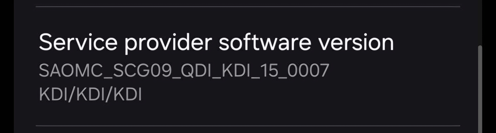

# Modem and bootloader repository
**for Snapdragon 888 Devices**

To [download](https://github.com/MonsterROM-8-5/proprietary_vendor_samsung_sm8350/releases) the correct binaries for your firmware, check your device's model number and your current OMC sales code (ex. SCG09**QDI**1EYJ1):

### Credits
- [@jesec](https://github.com/jesec) and [@corsicanu](https://github.com/corsicanu) for the original GitHub Actions script.
- [UN1CA](https://github.com/UN1CA) for the inspo to this repo :3
